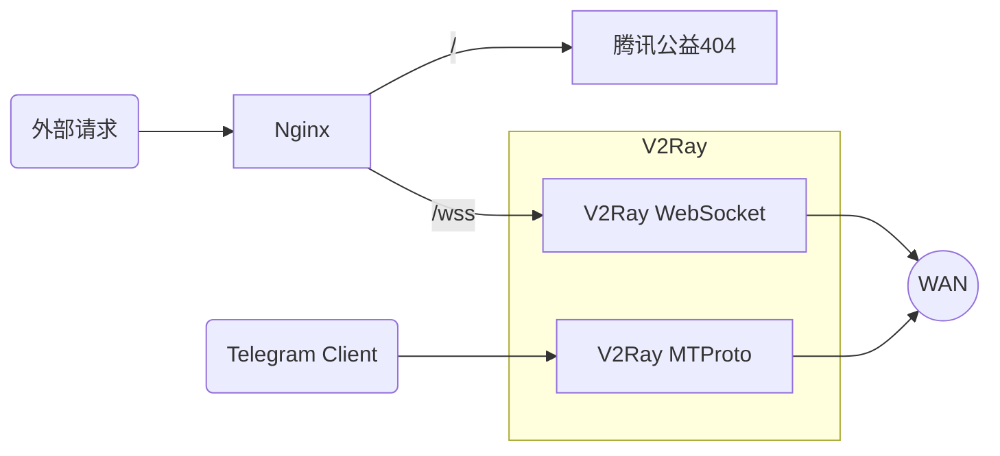

## 前言

当前 V2Ray 应该算是比较好用的翻墙软件，和 ss、ssr 相比还是很稳定的，不容易被检测，尤其是加上 Nginx 和 TLS，再做个简单的网站顶在前面，完全伪造成了一个正常的网页访问行为，非常安全可靠，并且具有很强的抗检测能力。

- **_必须会简单使用 Linux 命令行，即 Shell_**
- **_以下示例中的域名均为`www.example.cc`，域名、UUID 以及 MTProto 的密钥请记得替换成自己的_**
- 有耐心、喜欢折腾或者想自己学点东西的就往下看
- 没耐心的可以去用机场或者一键脚本
- 这是针对学生和工薪阶层且有科学上网需求的同志，土豪请直接用机场去吧（比如[外号 richCloud 的 rixCloud](https://rixcloud.me/)）

### 参考文档

[V2Ray 官方文档](https://www.v2ray.com/)
[V2Ray 白话文教程](https://toutyrater.github.io/)
[MTProxy 官方文档](https://github.com/TelegramMessenger/MTProxy)

### 涉及的内容



1. 域名申请；
2. Let's Encrypt 申请 SSL 证书；
3. Nginx 作为前置服务配置 web 主页；
4. 通过配置 Nginx 反向代理访问后面的 v2ray 服务；
5. v2ray 同时提供 mtproto 服务；
6. 使用腾讯公益 404 作为 web 主页；

### 大致的步骤

1. 准备服务器；
2. 申请域名；
3. 创建网站根目录；
4. 安装 Nginx；
5. 获得 SSL 证书；
6. 修改 Nginx 配置支持 Https；
7. 安装启动 V2Ray；

## 安装部署

### 端口规划

| Port  | Listen IP | Use             |
| ----- | --------- | --------------- |
| 80    | 0.0.0.0   | Nginx Http      |
| 443   | 0.0.0.0   | Nginx Https     |
| 10443 | 127.0.0.1 | V2Ray WebSocket |
| 8080  | 0.0.0.0   | V2Ray MTProto   |

### 服务器准备

拿来翻墙用的服务器，肯定是本着便宜好用性价比高的原则来选择。[搬瓦工](https://bwh8.net/)毕竟有 cn2 和 cn2 gia 线路，价格也算是最便宜的，重点可以支付宝支付，还是选择搬瓦工吧。

逢年过节，搬瓦工都会推出特别款优惠主机，比如双十一、黑五，性价比极高！可以关注下。

#### BandwagonHost 套餐选择

搬瓦工套餐很多，相同配置不同价格排序如下：
`普通线路 < CN2线路 < CN2 GIA线路`
一般情况下个人使用或者家用的话，最便宜的套餐足以，不常看视频，一个月流量在 100-200GB。

注册购买什么的就不赘述了，现在上过学都看得懂英文。

根据自己的需求选择相应的配置即可，避免浪费。

- 访问谷歌，简单的网页访问需求

```text
10G VZ - PROMO
SSD: 10 GB RAID-10
RAM: 512 MB
CPU: 1x Intel Xeon
Transfer: 500 GB/mo
Link speed: 1 Gigabit
```

19.99 美刀一年，只能年付。
OpenVZ 架构，唯一的优势就是便宜。高峰期对主机性能和网络都有影响。

- 偶尔看看视频，比如油管

```text
SPECIAL 10G KVM PROMO V3 - LOS ANGELES - CN2
SSD: 10 GB RAID-10
RAM: 512 MB
CPU: 1x Intel Xeon
Transfer: 500 GB/mo
Link speed: 1 Gigabit
```

29.99 美刀一年，只能年付。**_一般人建议买这个_**。
KVM 架构，延迟勉强，`170ms`左右，油管 4K 撑得住。高峰期对网络有一定影响。

- 强烈视频需求，打游戏，需要低延迟网络

```text
SPECIAL 10G KVM PROMO V3 - LOS ANGELES - CN2 GIA - LIMITED EDITION
**Limited stock available**
SSD: 10 GB RAID-10
RAM: 512 MB
CPU: 1x Intel Xeon
Transfer: 300 GB/mo
Link speed: 1 Gigabit
```

39.99 美刀一年，只能年付。此套餐经常缺货，想买的需要关注，有钱可以买上一级套餐（可季付、半年付、年付）。

同样 KVM 架构，延迟比 cn2 略低，油管 4K 撑得住。高峰期对网络影响较小。

#### 准备软件

1、 [MobaXterm](https://mobaxterm.mobatek.net/): SSH 客户端工具，集成了 SFTP，安装免费版即可
2、 [Visual Studio Code](https://code.visualstudio.com/): 编辑器，主要拿来编辑 Nginx 的配置文件和 V2ray 的配置文件，支持 JSON 代码高亮，避免配置文件编写错误

#### 配置服务器

这里以搬瓦工为例。

##### 更换操作系统

建议选择 CentOS7 吧，方便好用。如果是 KVM 架构的机器，还能选择支持 bbr 的操作 CentOS。这里以 CN2 GIA 的服务器为例。

**_以下命令均以 CentOS7 下的命令为例_**

- 登录搬瓦工`Client Area`，点`Services -> My Services`查看自己的所有服务
- 点击对应`Product/Service`后面的`KiwiVM Control Panel`按钮进入控制台
  
- 首先将虚拟机关机，关机后才能重装系统
  
- 选择`Install new OS`，然后选择`"centos-7-x86_64-bbr"`，勾选`"I agree ..."`，点`Reload`重新安装
  
- **_记下 root 密码和端口号备用_**

##### 更改服务器密码

使用 MobaXterm（或者其他 SSH 工具），使用刚刚的密码和端口号登录服务器，注意下**端口号**，搬瓦工的 SSH 不是默认 22 端口。
登录后执行`passwd`，然后输入两遍新密码即可

```bash
$ passwd
Changing password for user root.
New password:
Retype new password:
passwd: all authentication tokens updated successfully.
```

##### 更新系统

搬瓦工自带的 epel 总觉得缺包，所以卸载重新安装下。
同时需要安装下 vim、git、zip 和 unzip。

```bash
yum remove -y epel-release
yum install -y epel-release
yum update -y
yum install -y vim git zip unzip
```

#### 申请域名

由于要使用 TLS，所以需要一个域名。建议注册`.cc`结尾的域名，便宜并且不需要实名认证。
传送门：[https://wanwang.aliyun.com/](https://wanwang.aliyun.com/)

**_假设我们申请的域名的是：`example.cc`，编写配置文件时记得替换成自己的。_**

##### 配置域名解析

域名解析这里配置两条，把`example.cc`和`www.example.cc`都指向服务器的地址。


配置好之后，可以在本地 ping 一下，看看通没通。

```bash
ping example.cc
```

#### 准备 web 根目录

- 新建目录

  ```bash
  mkdir -p /www/root
  ```

- 增加`index.html`

  ```bash
  vim /www/root/index.html
  ```

  按下`i`键到插入模式后，将以下所有内容贴进去。

  ```html
  <!DOCTYPE html>
  <html>
    <head>
      <title>404</title>
      <meta http-equiv="Content-Type" content="text/html" charset="UTF-8" />
      <script
        type="text/javascript"
        src="//qzonestyle.gtimg.cn/qzone/hybrid/app/404/search_children.js"
        charset="utf-8"
        homePageUrl="https://www.example.cc/"
        homePageName="回到我的主页"
      ></script>
    </head>
  </html>
  ```

#### 安装配置 Nginx

Nginx 安装后，会用到两份配置：

- 第一份是给第一次申请 Let's Encrypt 的 SSL 证书用的（由于此时还没有证书，配置成 Https）
- 第二份是增加了 V2Ray 反代和 Http 重定向 Https 的配置，这个就是一直要用的配置

##### 安装 Nginx

很简单，一行命令搞定。

```bash
yum install -y nginx
```

##### 编辑`nginx.conf`

文件`/etc/nginx/nginx.conf`。
害怕出错的或者新手请将文件 SFTP 下载到本地，使用 VSCode 修改后再 SFTP 传回服务器。
熟悉 vim 的就直接在命令行修改吧。

配置文件如下：

```nginx
user nginx;
worker_processes auto;
error_log /dev/null;
pid /run/nginx.pid;

include /usr/share/nginx/modules/*.conf;

events {
    worker_connections 1024;
}

http {
    log_format  main  '$remote_addr - $remote_user [$time_local] "$request" '
                      '$status $body_bytes_sent "$http_referer" '
                      '"$http_user_agent" "$http_x_forwarded_for"';

    access_log  off;

    sendfile            on;
    tcp_nopush          on;
    tcp_nodelay         on;
    keepalive_timeout   65;
    types_hash_max_size 2048;

    include             /etc/nginx/mime.types;
    default_type        application/octet-stream;

    include /etc/nginx/conf.d/*.conf;

    server {
        listen       80 default_server;
        listen       [::]:80 default_server;
        server_name  example.cc www.example.cc;
        root         /www/root;
        index        index.html index.htm;

        location / {
        }
    }
}
```

##### 启动 Nginx 服务

```bash
systemctl enable nginx
systemctl start nginx
```

然后查看下运行状态是否已经正常启动，看到`running`即是正常。

```bash
$ systemctl status nginx
● nginx.service - The nginx HTTP and reverse proxy server
   Loaded: loaded (/usr/lib/systemd/system/nginx.service; enabled; vendor preset: disabled)
   Active: active (running) since Wed 2018-11-14 11:22:53 CST; 4 days ago
```

然后打开浏览器访问**www.example.cc**和**example.cc**看是否能打开腾讯公益 404 页面。能打开说明 Nginx 已经正确配置，然后就可以开始申请 SSL 证书了。

#### 安装 V2Ray

具体参考[V2Ray 官方文档](https://www.v2ray.com/chapter_00/install.html#linuxscript)：

```bash
bash <(curl -L -s https://install.direct/go.sh)
```

安装完成后自动启动，这里先把它给停了

```bash
systemctl stop v2ray
```

#### 申请 Let's Encrypt 的 SSL 证书

Let's Encrypt 有很多 ACME 客户端的实现。这里选用[acme.sh](https://github.com/Neilpang/acme.sh/wiki/%E8%AF%B4%E6%98%8E)。

##### 安装 acme.sh

安装很简单，一个命令：

```bash
curl  https://get.acme.sh | sh
```

安装完成后执行下

```bash
source /root/.bashrc
```

##### 申请证书

很简单，一也是命令：

```bash
acme.sh --issue -d example.cc -d www.example.cc --webroot /www/root/ -k ec-256
```

使用 ec-256 证书，让通信更安全吧。

##### 将证书安装到目录

这里将证书放到`/etx/v2ray`目录下。

```bash
acme.sh --installcert -d example.cc -d www.example.cc --key-file /etc/v2ray/v2ray.key --fullchain-file /etc/v2ray/v2ray.crt --ecc --reloadcmd  "service nginx force-reload && systemctl restart v2ray"
```

这行命令除了将证书放到指定目录下外，还会自动创建 crontab 定时任务，后面引号里的命令是定时任务更新证书后执行的命令。

#### 配置 Nginx 支持 Https 访问

不废话了，直接修改`/etc/nginx/nginx.conf`，完整配置文件如下：

```nginx
user nginx;
worker_processes auto;
error_log /dev/null;
pid /run/nginx.pid;

include /usr/share/nginx/modules/*.conf;

events {
    worker_connections 1024;
}

http {
    log_format  main  '$remote_addr - $remote_user [$time_local] "$request" '
                      '$status $body_bytes_sent "$http_referer" '
                      '"$http_user_agent" "$http_x_forwarded_for"';

    access_log  off;

    server_tokens       off;
    sendfile            on;
    tcp_nopush          on;
    tcp_nodelay         on;
    keepalive_timeout   65;
    types_hash_max_size 2048;

    include             /etc/nginx/mime.types;
    default_type        application/octet-stream;

    include /etc/nginx/conf.d/*.conf;

    # Http Server，强制跳转Https
    server {
        listen       80 default_server;
        listen       [::]:80 default_server;
        server_name  example.cc www.example.cc;
        rewrite      ^(.*)$ https://www.example.cc$1 permanent;
    }

    # Https Server
    server {
        listen       443 ssl http2 default_server;
        listen       [::]:443 ssl http2 default_server;
        server_name  www.example.cc;
        root         /www/root;
        index        index.html index.htm;

        ssl_certificate "/etc/v2ray/v2ray.crt";
        ssl_certificate_key "/etc/v2ray/v2ray.key";
        ssl_session_cache shared:SSL:1m;
        ssl_session_timeout  10m;
        ssl_ciphers HIGH:!aNULL:!MD5;
        ssl_prefer_server_ciphers on;

        include /etc/nginx/default.d/*.conf;

        location / {
        }

        # 反向代理V2Ray
        location /wss {
            proxy_redirect off;
            proxy_pass http://127.0.0.1:10443;
            proxy_http_version 1.1;
            proxy_set_header Upgrade $http_upgrade;
            proxy_set_header Connection "upgrade";
            proxy_set_header Host $http_host;
        }

        error_page 404 /404.html;
        location = /40x.html {
        }

        error_page 500 502 503 504 /50x.html;
            location = /50x.html {
        }
    }
}
```

配置完之后重新启动 Nginx

```bash
systemctl restart nginx
```

访问**www.example.cc**和**example.cc**，如果自动跳转`https://www.example.cc`并且正确显示公益 404 则已经配置正确。

#### 配置 V2Ray 并启动

前置的所有服务都已经配置完毕，只差最后的 V2Ray 了。

##### 为 V2Ray 生成一个 UUID

使用 V2Ray 自带的`v2ctl`工具生成一个新的 uuid。

```bash
$ /usr/bin/v2ray/v2ctl uuid
27e0efcc-8e13-fef1-9e82-febebc469b2b
```

记录下此 uuid

##### 为 mtproto 生成一个密钥

使用 linux 系统创建伪随机数作为密钥。

```bash
$ head -c 16 /dev/urandom | xxd -ps
80e2e037610bac1444ac02979364f666
```

记录下此随机数

##### 修改`/etc/v2ray/config.json`

同样的，没把握用 vim 修改的，就拷贝下来在 VSCode 里修改，改完再传回服务器。

将刚生成的 uuid 和随机数填入对应的位置。

完整配置文件如下：

```json
{
  "log": {
    "loglevel": "none",
    "access": "/var/log/v2ray/access.log",
    "error": "/var/log/v2ray/error.log"
  },
  "inbounds": [
    {
      "port": 10443,
      "listen": "127.0.0.1",
      "protocol": "vmess",
      "settings": {
        "clients": [
          {
            "id": "27e0efcc-8e13-fef1-9e82-febebc469b2b",
            "alterId": 64
          }
        ]
      },
      "streamSettings": {
        "network": "ws",
        "wsSettings": {
          "path": "/wss"
        }
      }
    },
    {
      "tag": "tg-in",
      "port": 8080,
      "protocol": "mtproto",
      "settings": {
        "users": [
          {
            "secret": "80e2e037610bac1444ac02979364f666"
          }
        ]
      }
    }
  ],
  "outbounds": [
    {
      "protocol": "freedom",
      "settings": {}
    },
    {
      "protocol": "blackhole",
      "settings": {
        "response": {
          "type": "none"
        }
      },
      "tag": "blocked"
    },
    {
      "tag": "tg-out",
      "protocol": "mtproto",
      "settings": {}
    }
  ],
  "routing": {
    "domainStrategy": "IPOnDemand",
    "settings": {
      "rules": [
        {
          "type": "field",
          "ip": ["geoip:private"],
          "outboundTag": "blocked"
        },
        {
          "type": "field",
          "inboundTag": ["tg-in"],
          "outboundTag": "tg-out"
        }
      ]
    }
  }
}
```

#####　启动 V2Ray

开启开机启动并启动。

```bash
systemctl enable v2ray
systemctl start v2ray
```

启动之后查看下运行状态，看是否正常运行

```bash
$systemctl status v2ray
● v2ray.service - V2Ray Service
   Loaded: loaded (/etc/systemd/system/v2ray.service; enabled; vendor preset: disabled)
   Active: active (running) since Sun 2018-11-18 17:00:07 CST; 3h 26min ago
 Main PID: 8908 (v2ray)
   CGroup: /system.slice/v2ray.service
           └─8908 /usr/bin/v2ray/v2ray -config /etc/v2ray/config.json
```

## 客户端配置

客户端配置不尽相同，对应客户端详细配置可以自己百度。

这里用文字描述下大致的配置步骤：

1. 协议类型选择`Vmess`，需要和服务端一致
2. 地址填`www.example.cc`，需要和服务端一致
3. 端口填`443`，需要和服务端一致
4. UUID 填`27e0efcc-8e13-fef1-9e82-febebc469b2b`，需要和服务端一致
5. 传输协议选择`ws`，路径填写`/wss`，需要和服务端一致
6. 开启 TLS
7. AlterId 填写`64`，需要和服务端一致

### IOS 客户端

IOS 下的 VPN 类客户端在国区基本下架下完了，V2Ray 推荐使用 Kitsunebi 的 TestFlight 版本。

1. 在手机上安装 TestFlight App：[https://itunes.apple.com/us/app/testflight/id899247664?mt=8](https://itunes.apple.com/us/app/testflight/id899247664?mt=8)
2. 在手机上打开这个链接自动加入 TestFlight：[https://testflight.apple.com/join/2w6EF67u](https://testflight.apple.com/join/2w6EF67u)

-->[原文地址](https://docs.google.com/forms/d/1-1ZuYA1qkyDfAn6qzUzNEV3YVZbgr__7b6aFBiKeNHc/closedform)

### 其它

其它客户端请参考：
[Windows](https://www.v2ray.com/ui_client/windows.html#windows-%E5%AE%A2%E6%88%B7%E7%AB%AF)
[Android](https://www.v2ray.com/ui_client/android.html#android-%E5%AE%A2%E6%88%B7%E7%AB%AF)
[Mac OS X](https://www.v2ray.com/ui_client/osx.html#mac-os-x)

### 最后提供两份客户端配置文件

无需求的以下就可以不看了。

#### PC 用的支持国内外分流

```json
{
  "inbounds": [
    {
      "port": 1087,
      "listen": "127.0.0.1",
      "protocol": "http",
      "settings": {
        "allowTransparent": true
      }
    },
    {
      "port": 1086,
      "listen": "127.0.0.1",
      "protocol": "socks",
      "domainOverride": ["tls", "http"],
      "settings": {
        "auth": "noauth",
        "udp": true
      }
    }
  ],
  "outbounds": [
    {
      "protocol": "vmess",
      "settings": {
        "vnext": [
          {
            "address": "www.example.cc",
            "port": 443,
            "users": [
              {
                "id": "27e0efcc-8e13-fef1-9e82-febebc469b2b",
                "alterId": 64,
                "security": "auto"
              }
            ]
          }
        ]
      },
      "streamSettings": {
        "network": "ws",
        "wsSettings": {
          "path": "/wss"
        },
        "security": "tls"
      },
      "mux": {
        "enabled": false,
        "concurrency": 8
      },
      "tag": "proxy"
    },
    {
      "protocol": "freedom",
      "settings": {},
      "tag": "direct"
    },
    {
      "protocol": "blackhole",
      "settings": {},
      "tag": "block"
    }
  ],
  "log": {
    "loglevel": "none",
    "access": "D:/v2ray_access.log",
    "error": "D:/v2ray_error.log"
  },
  "dns": {
    "hosts": {
      "example.com": "127.0.0.1"
    },
    "servers": ["223.5.5.5", "8.8.8.8", "localhost"]
  },
  "routing": {
    "strategy": "rules",
    "settings": {
      "domainStrategy": "IPIfNonMatch",
      "rules": [
        {
          "type": "field",
          "domain": [
            "dropbox",
            "github",
            "google",
            "instagram",
            "netflix",
            "pinterest",
            "pixiv",
            "tumblr",
            "twitter",
            "domain:facebook.com",
            "domain:fbcdn.net",
            "domain:fivecdm.com",
            "domain:ggpht.com",
            "domain:gstatic.com",
            "domain:line-scdn.net",
            "domain:line.me",
            "domain:medium.com",
            "domain:naver.jp",
            "domain:pximg.net",
            "domain:t.co",
            "domain:twimg.com",
            "domain:youtube.com",
            "domain:ytimg.com"
          ],
          "outboundTag": "proxy"
        },
        {
          "type": "field",
          "ip": [
            "125.209.222.0/24",
            "149.154.167.0/24",
            "149.154.175.0/24",
            "91.108.56.0/24"
          ],
          "outboundTag": "proxy"
        },
        {
          "type": "field",
          "domain": [
            "cctv",
            "geosite:cn",
            "umeng",
            "domain:apple.com",
            "domain:crashlytics.com",
            "domain:icloud.com",
            "domain:ixigua.com",
            "domain:pstatp.com",
            "domain:snssdk.com",
            "domain:toutiao.com"
          ],
          "outboundTag": "direct"
        },
        {
          "type": "field",
          "ip": ["geoip:cn", "geoip:private"],
          "outboundTag": "direct"
        },
        {
          "type": "field",
          "domain": ["domain:doubleclick.net"],
          "outboundTag": "block"
        }
      ]
    }
  }
}
```

#### 路由器用的，透明代理

```json
{
  "inbounds": [
    {
      "port": 7070,
      "protocol": "dokodemo-door",
      "domainOverride": ["tls", "http"],
      "address": "",
      "settings": {
        "network": "tcp,udp",
        "timeout": 30,
        "followRedirect": true
      }
    }
  ],
  "outbounds": [
    {
      "protocol": "vmess",
      "settings": {
        "vnext": [
          {
            "address": "www.example.cc",
            "port": 443,
            "users": [
              {
                "id": "27e0efcc-8e13-fef1-9e82-febebc469b2b",
                "alterId": 64,
                "security": "auto"
              }
            ]
          }
        ]
      },
      "streamSettings": {
        "network": "ws",
        "wsSettings": {
          "path": "/wss"
        },
        "security": "tls"
      },
      "mux": {
        "enabled": false
      }
    }
  ],
  "log": {
    "loglevel": "none",
    "access": "",
    "error": ""
  },
  "dns": {
    "servers": ["localhost"]
  }
}
```
